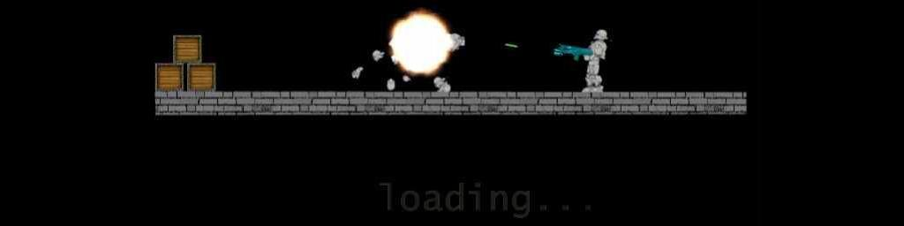

# Survival



A 2D side-scrolling shooter originally written in 2006 for **Windows / Visual Studio 2003 / DirectX 9**, ported to a modern **C++20 / SDL2** codebase that builds and runs on **Linux** and **Windows**.

The project doubles as a worked example of an end-to-end legacy-game port: every step in the journey from the original DirectX source to the current cross-platform build is preserved as a git tag.

| Tag | What you get |
|-----|--------------|
| `legacy-dx9`        | The 2006 source tree, byte-for-byte. |
| `linux-mvp`         | First playable build on Linux via SDL2. |
| `phase-1-complete`  | Linux build is `-Wall -Wextra` clean. |
| `phase-2-complete`  | Behaviourally verified — physics, AI, ragdolls, particles, HUD all match the original. |
| `phase-3-complete`  | Modern C++20: `enum class`, `std::vector`, `std::filesystem`, RAII; gameplay layer split into subsystems; Catch2 tests; Linux + Windows CI. |

A diff between any two tags shows exactly what one phase of the port changed.

## Build

### Linux

```sh
sudo apt install libsdl2-dev libsdl2-image-dev libsdl2-ttf-dev libsdl2-gfx-dev catch2
cmake --preset linux-gcc       # or linux-clang
cmake --build --preset linux-gcc
ctest --preset linux-gcc       # 14 unit tests
./build/linux-gcc/game
```

### Windows (MSVC + vcpkg)

```cmd
cmake --preset windows-msvc
cmake --build --preset windows-msvc
ctest --preset windows-msvc
build\windows-msvc\Release\game.exe
```

The vcpkg toolchain file is read from `%VCPKG_ROOT%`. Manifest-mode (`vcpkg.json`) installs SDL2 + Catch2 on first configure. Visual Studio 2022 17.7+ recommended.

## Controls

| | |
|---|---|
| **A / D** | Walk left / right |
| **W** | Jump |
| **Q** | Wall-jump |
| Mouse | Aim |
| **Left-click** | Shoot |
| **Right-click** | Throw grenade |
| **Insert / Delete** | Spawn / remove an AI opponent |
| **Tab** | Hold for scoreboard *(deferred — needs custom blend mode)* |
| **Esc** | Quit |

## Repository layout

```
compat/      Win32 / D3DX type shims for non-MSVC + a tiny Affine2D
             helper that replaces the legacy D3DXMATRIX chain.
physics/     2D vector math + SAT rigid-body simulator (math2D, physics2D).
graphics/    SPRITE, MODEL (the 15-part articulated soldier), PARTICLE.
platform/    SDL entry point, INI loader, SDL_ttf font wrapper.
game/        ai, effects, lifecycle, players, render, world.
tests/       Catch2 unit tests for math2D / physics2D.
data/        Maps, meshes, models, sprites, textures, bundled DejaVu fonts.
```

See [`CLAUDE.md`](CLAUDE.md) for the deeper architecture notes — cross-cutting state, render-pipeline quirks, the rotation-flip convention, and the few surviving legacy artefacts that match the original 2006 build by design.

## CI

`.github/workflows/ci.yml` runs on every push and pull request:

1. **lint** — `clang-format --dry-run --Werror` + `clang-tidy` (rules in `.clang-format` and `.clang-tidy`). Scoped to changed files when possible.
2. **build matrix** — Linux GCC, Linux Clang, Windows MSVC. ccache + vcpkg-install caching seeded on first run.

A red lint job blocks the build matrix entirely, so a malformed push fails in ~30 seconds.

## Phase 4 (open)

The legacy distribution shipped four standalone tools (`map_editor.exe`, `animator.exe`, `particlesystem.exe`, `UI.exe`) whose sources aren't in this repo. The port plan tags those for a Phase 4 inventory + selective rebuild on top of the modern libraries (likely Dear ImGui + SDL2). Not yet started.
